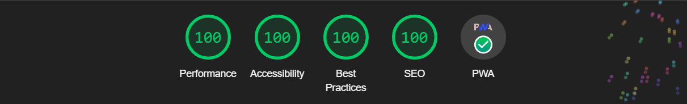

# MediaBox


**View at:** [MediaBox App](https://pruthvik007.github.io/movies-and-series/)

## Description

MediaBox is an application designed for users to easily access information about movies and TV shows. With a sleek interface and user-friendly design, MediaBox allows users to browse through a vast library of movies and TV shows, view details, watch trailers, and even stream media directly within the app. Additionally, MediaBox allows users to perform advanced filtering of movies and shows based on genres, categories, and production companies.

## Technologies Used

MediaBox is built using the following technologies:

- **React**: A powerful JavaScript library for building user interfaces.
- **TypeScript**: A typed superset of JavaScript that enhances code quality and developer productivity.
- **Vite**: A fast build tool that provides a lightning-fast development experience.
- **Tailwind CSS**: A utility-first CSS framework for quickly styling applications.
- **Daisy UI**: A component library built on top of Tailwind CSS for easy UI development.
- **React Query**: A library for managing, caching, and syncing asynchronous data in React applications.
- **TMDB API**: The Movie Database API, used to fetch movie and TV show data.

## Key Features

- **Responsive Design**: MediaBox is optimized for various devices, ensuring a seamless user experience across desktop, tablet, and mobile screens.
- **Advanced Filtering**: Users can filter movies and shows based on genres, categories, and production companies for a more personalized browsing experience.
- **Continuous Integration/Continuous Deployment (CI/CD)**: GitHub Actions are utilized for automated CI/CD pipelines, streamlining the development and deployment process.
- **Reusable Components**: MediaBox follows best practices by implementing reusable components, promoting code reusability and maintainability.
- **Caching with React Query**: Duplicate requests are avoided through efficient caching with React Query, enhancing performance and reducing server load.
- **Customizable Themes**: Users can switch between two themes, allowing for personalized viewing experiences.
- **Trailers and Media Playback**: MediaBox enables users to watch trailers and stream media directly within the application, providing a comprehensive entertainment experience.
- **Lighthouse Ratings**: MediaBox has earned perfect Lighthouse scores in Performance, Accessibility, Best Practices, and SEO.

## LightHouse Results



## Installation

To install and run MediaBox locally, follow these steps:

1. Clone the repository:
   ```bash
     git clone https://github.com/pruthvik007/movies-and-series.git
   ```
2. Navigate to the project directory:
   ```bash
     cd movies-and-series
   ```
3. Install dependencies:
   ```bash
     npm install
   ```
4. Add your TMDB API Key:
   Create a .env file in the root of the project and add your TMDB API key:
   ```plaintext
     VITE_TMDB_API_KEY=your_tmdb_api_key_here
   ```
5. Start the development server:
   ```bash
     npm run dev
   ```

## Usage

Once the development server is running, you can access the application at http://localhost:5173/movies-and-series/ in your web browser. Browse through the media library, filter content, watch trailers, and enjoy the seamless experience provided by MediaBox.
